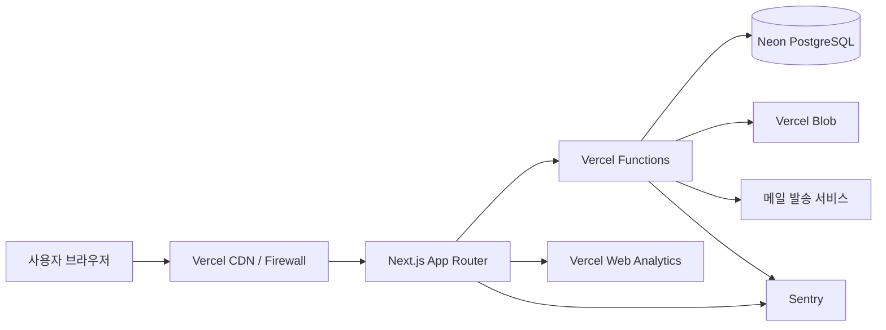
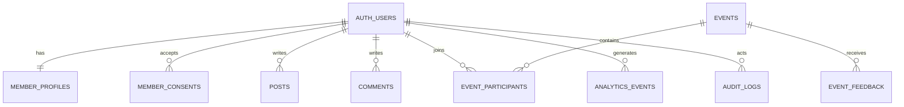

# 부산 기반 IT 소모임 커뮤니티 기술·데이터·보안 설계안

> 문서 버전: 0.1  
> 작성 기준일: 2026-07-29  
> 대상: Next.js App Router + Vercel 기반의 부산 IT 커뮤니티 MVP  
> 상태: 초기 설계안 — 실제 출시 전 개인정보 처리방침·이용약관과 클라우드 계약 조건을 최종 확인해야 함

---

## 0. 핵심 결론

이 프로젝트는 다음 구조를 권장한다.

- **프론트엔드 + 백엔드:** Next.js App Router를 Vercel에 배포
- **API:** Next.js Route Handler / Server Function을 Vercel Functions로 실행
- **DB:** Vercel 자체 서버에 DB를 올리는 방식이 아니라, **Vercel Marketplace에서 Neon PostgreSQL 같은 외부 관리형 DB를 연결**
- **ORM:** Drizzle ORM
- **인증:** Better Auth + Google/GitHub 로그인부터 시작
- **파일:** 프로필·행사 이미지는 Vercel Blob 또는 별도 Object Storage
- **익명 웹 통계:** Vercel Web Analytics
- **회원 행동 이벤트:** 자체 `analytics_events` 테이블에 최소한으로 수집
- **오류 추적:** Sentry 등 외부 오류 모니터링 서비스 연동
- **보안:** Vercel WAF, Rate Limiting, MFA, 권한 분리, 로그 마스킹, DB 백업
- **개인정보 원칙:** 많이 모으는 것보다 **목적별로 필요한 데이터만 분리 수집**하는 방향

중요한 원칙은 다음과 같다.

1. **회원정보와 행동분석 데이터를 같은 JSON 덩어리로 저장하지 않는다.**
2. **운영 로그에 이메일, 전화번호, 토큰, 쿠키, 요청 본문을 남기지 않는다.**
3. **모든 Server Action과 API에서 인증·권한을 다시 검사한다.**
4. **관리자 계정은 일반 회원 계정과 분리하고 MFA를 적용한다.**
5. **탈퇴·동의 철회·데이터 삭제가 실제 DB에서 동작하도록 출시 전에 구현한다.**

---

## 1. Vercel 구조에 대한 정확한 이해

“DB, 프론트, 백엔드를 모두 Vercel에서 사용한다”는 표현은 절반 정도 맞다.

Vercel은 다음 영역을 담당한다.

- Next.js 정적 페이지 및 서버 렌더링
- Route Handler, Server Action 등 서버 코드 실행
- CDN, 도메인, TLS
- 배포 환경
- Runtime Logs
- Web Analytics
- Firewall / WAF
- Cron Jobs
- Marketplace 연동

그러나 PostgreSQL은 일반적으로 Vercel 내부에 직접 설치하는 방식이 아니다. Vercel Marketplace를 통해 Neon, Supabase, AWS 계열 등 **외부 데이터베이스 공급자**를 연결하고, 접속 정보가 Vercel 환경변수에 주입되는 구조다.

### 권장 배치



### 리전 원칙

- Vercel Function과 DB 리전은 가능한 가까운 곳으로 맞춘다.
- DB 공급자가 한국 리전을 지원하지 않는다면 싱가포르·도쿄 등 가장 가까운 지원 리전을 검토한다.
- 해외 리전에서 개인정보가 저장·처리되는 경우 개인정보 처리방침의 **국외 이전 또는 국외 처리 관련 내용**을 별도로 검토한다.
- 공급자, 저장 위치, 이전 항목, 목적, 기간, 거부 방법 등이 실제 시스템과 문서에서 일치해야 한다.

---

## 2. 권장 기술 스택

| 영역 | 권장안 | 이유 |
|---|---|---|
| 프레임워크 | Next.js App Router | 프론트와 서버 기능을 하나의 TypeScript 프로젝트에서 관리 |
| 배포 | Vercel | Next.js 배포, 프리뷰, Functions, Firewall 연동 |
| DB | Neon PostgreSQL via Vercel Marketplace | Serverless 환경과 연결이 편하고 PostgreSQL 사용 가능 |
| ORM | Drizzle ORM | TypeScript 친화적이고 SQL 구조를 명확하게 유지 |
| 인증 | Better Auth | 자체 인증 재구현을 줄이고 세션·소셜로그인·검증 기능 활용 |
| 검증 | Zod | 폼, API, 환경변수 입력 검증 |
| 파일 저장 | Vercel Blob | 프로필·행사 이미지 저장, DB에 바이너리 저장 금지 |
| 웹 통계 | Vercel Web Analytics | 쿠키 없는 익명 집계 중심으로 MVP에 적합 |
| 제품 분석 | 자체 이벤트 테이블 | 회원의 기능 사용 흐름을 목적에 맞게 제한 수집 |
| 오류 추적 | Sentry | 클라이언트·서버 오류, 릴리즈별 오류 추적 |
| 메일 | Resend 등 | 가입 인증, 행사 안내, 운영 알림 |
| 스타일 | Tailwind CSS | 빠른 MVP 및 반응형 구현 |
| 패키지 관리 | pnpm | lockfile 고정, 모노레포 확장 용이 |

### 처음부터 분리하지 않아도 되는 것

초기에는 별도 NestJS 서버를 만들 필요가 없다. 다음 조건이 생기기 전까지는 Next.js Route Handler와 Server Function으로 충분하다.

- 실시간 채팅 연결이 많아짐
- 장시간 실행 작업이 많아짐
- 별도 모바일 앱과 공용 API가 복잡해짐
- 도메인 로직이 매우 커짐
- 메시지 큐와 워커가 필수가 됨
- 대규모 WebSocket 서버가 필요함

---

## 3. 기능 범위

## 3.1 MVP 필수 기능

### 계정

- Google 로그인
- GitHub 로그인
- 이메일 인증
- 로그아웃
- 모든 세션 로그아웃
- 회원 탈퇴
- 개인정보 열람·수정
- 선택 동의 변경

### 프로필

- 닉네임
- 프로필 이미지
- 짧은 자기소개
- 관심 기술
- 직군
- 경력 구간
- 활동 가능 지역
- 네트워킹 목적
- 공개 범위 설정
- GitHub·포트폴리오 링크

### 커뮤니티

- 게시글 작성·수정·삭제
- 댓글
- 좋아요
- 북마크
- 신고
- 공지사항
- 기술 태그
- 부산 지역 태그

### 오프라인 모임

- 행사 목록
- 행사 상세
- 참가 신청
- 대기 신청
- 참가 취소
- 참가자 정원
- 운영자 승인형 행사
- 참석 체크
- 행사 후기
- 사진 촬영 동의 여부

### 관리자

- 회원 검색
- 회원 상태 변경
- 신고 처리
- 게시글 숨김
- 행사 생성·수정
- 참가자 내보내기
- 관리자 작업 이력 조회

## 3.2 2차 기능

- 소모임 개설 신청
- 소모임 운영자 역할
- 관심 기술 기반 추천
- 행사 알림
- 이메일 뉴스레터
- 멘토·멘티 매칭
- 채용·프로젝트 게시판
- 참가자 노쇼 관리
- 초대 코드
- 운영 대시보드

## 3.3 초기에는 제외하는 기능

초기 개인정보와 운영 위험을 줄이기 위해 다음 기능은 뒤로 미룬다.

- 실명 인증
- 휴대전화 본인인증
- 주민등록번호 수집
- 결제
- 회원 간 개인 메시지
- 실시간 위치 공유
- 자동 얼굴 인식
- AI 기반 민감정보 프로파일링
- 익명 사용자의 세밀한 크로스사이트 추적

---

## 4. 역할과 권한

문자열 상수 맵을 사용하고 DB에는 문자열을 저장한다.

```ts
export const memberRoles = {
  MEMBER: "member",
  ORGANIZER: "organizer",
  MODERATOR: "moderator",
  ADMIN: "admin",
} as const;

export interface MemberRole {
  value: (typeof memberRoles)[keyof typeof memberRoles];
}
```

### 권한 기준

| 기능 | member | organizer | moderator | admin |
|---|---:|---:|---:|---:|
| 게시글 작성 | O | O | O | O |
| 행사 신청 | O | O | O | O |
| 행사 개설 | X | O | O | O |
| 본인 행사 참가자 조회 | X | O | O | O |
| 신고 처리 | X | X | O | O |
| 회원 제재 | X | X | 제한 | O |
| 관리자 권한 변경 | X | X | X | O |
| 보안 로그 조회 | X | X | X | 제한된 O |

### 필수 권한 원칙

- UI에서 버튼을 숨기는 것만으로 권한을 구현하지 않는다.
- 모든 Server Action과 Route Handler에서 다시 권한을 확인한다.
- 운영자는 자신이 만든 행사 데이터만 조회한다.
- 관리자라도 전체 개인정보를 한 화면에서 무제한으로 내려받지 못하게 한다.
- CSV 내보내기는 사유 입력, 대상 범위, 다운로드 이력을 남긴다.

```ts
interface AuthorizationContext {
  userId: string;
  role: string;
}

interface ResourceOwnership {
  ownerId: string;
}

export function canManageEvent(
  context: AuthorizationContext,
  resource: ResourceOwnership,
): boolean {
  if (context.role === memberRoles.ADMIN) return true;
  if (context.role === memberRoles.MODERATOR) return true;

  return (
    context.role === memberRoles.ORGANIZER &&
    context.userId === resource.ownerId
  );
}
```

---

## 5. 사용자 데이터 수집 설계

## 5.1 수집 데이터 분류

| 등급 | 예시 | 처리 원칙 |
|---|---|---|
| Public | 닉네임, 공개 소개, 공개 기술 태그 | 사용자가 공개 범위를 선택 |
| Internal | 내부 회원 ID, 운영 상태, 신고 상태 | 운영 목적에만 사용 |
| Personal | 이메일, 소셜로그인 식별자, 참가 신청 | 최소 권한, 암호화 전송, 접근 기록 |
| Sensitive | 건강, 정치성향, 종교, 성생활 등 | 커뮤니티에서 수집하지 않음 |
| Secret | 세션 토큰, API 키, DB 비밀번호 | DB 일반 테이블·로그에 저장 금지 |

## 5.2 필수 가입 데이터

초기 가입은 다음 정도로 제한한다.

| 항목 | 필수 여부 | 목적 | 공개 여부 |
|---|---:|---|---|
| 내부 사용자 ID | 필수 | 계정 식별 | 비공개 |
| 이메일 | 필수 | 로그인·안내·계정 복구 | 비공개 |
| 이메일 인증 시각 | 필수 | 인증 상태 확인 | 비공개 |
| 로그인 제공자 | 필수 | 계정 연동 | 비공개 |
| 닉네임 | 필수 | 커뮤니티 표시 | 공개 또는 회원 공개 |
| 약관 버전 | 필수 | 동의 증빙 | 비공개 |
| 개인정보 처리방침 버전 | 필수 | 고지 이력 | 비공개 |
| 가입일 | 필수 | 운영 | 비공개 |

### 가입 단계에서 받지 않는 정보

- 실명
- 전화번호
- 생년월일
- 정확한 주소
- 회사명
- 직장 이메일
- 연봉
- 주민등록번호
- 계좌번호
- 건강정보

## 5.3 선택 프로필 데이터

선택 프로필은 회원이 입력하지 않아도 서비스 이용이 가능해야 한다.

```ts
export const experienceRanges = {
  BEGINNER: "beginner",
  ONE_TO_THREE: "1-3",
  FOUR_TO_SIX: "4-6",
  SEVEN_PLUS: "7+",
} as const;

export interface CommunityProfileInput {
  nickname: string;
  introduction?: string;
  jobCategory?: string;
  experienceRange?: string;
  interestedTopics?: string[];
  activityAreas?: string[];
  networkingGoals?: string[];
  githubUrl?: string;
  portfolioUrl?: string;
  isProfilePublic: boolean;
}
```

### 추천 선택 항목

- 직군: 백엔드, 프론트엔드, 앱, 게임, 디자인, 기획, 데이터, AI, DevOps 등
- 경력 구간: 입문, 1~3년, 4~6년, 7년 이상
- 관심 기술: TypeScript, React, Next.js, NestJS, Unity, Unreal, AWS 등
- 지역: 부산진구, 해운대구, 수영구 등 넓은 범위
- 참여 목적: 네트워킹, 스터디, 사이드프로젝트, 채용, 멘토링
- 활동 가능 시간대: 평일 저녁, 토요일, 일요일

정확한 집 주소나 실시간 위치는 받지 않는다.

## 5.4 행사 신청 데이터

행사별로 필요한 항목을 별도로 정의한다.

| 항목 | 기본값 | 비고 |
|---|---|---|
| 사용자 ID | 필수 | 회원 계정 연결 |
| 행사 ID | 필수 | 신청 대상 |
| 신청 상태 | 필수 | 신청·대기·승인·취소 |
| 참가 목적 | 선택 | 행사 운영 개선 |
| 질문 | 선택 | 발표자 사전 질문 |
| 촬영 동의 | 선택 | 행사별 동의 |
| 참석 여부 | 운영 생성 | 체크인 결과 |
| 취소 시각 | 운영 생성 | 노쇼 분석 |
| 전화번호 | 기본 미수집 | 현장 운영상 꼭 필요할 때만 행사별 별도 수집 |

## 5.5 수집하지 말아야 할 정보

다음 정보는 로그, 게시글 메타데이터, 분석 이벤트에도 넣지 않는다.

- 비밀번호 원문
- 인증 토큰
- OAuth access token
- Authorization 헤더
- 전체 Cookie 헤더
- 주민등록번호
- 계좌·카드 정보
- 정확한 GPS 좌표
- 사용자가 작성한 비공개 메시지 전문
- 폼 전체 요청 본문
- 다른 서비스의 비밀키
- 관리자 다운로드 파일의 원본 내용

---

## 6. 데이터베이스 설계

## 6.1 테이블 그룹

### 인증 영역

Better Auth가 관리하는 테이블은 별도 네임스페이스 또는 명확한 접두사를 사용한다.

- `auth_users`
- `auth_sessions`
- `auth_accounts`
- `auth_verifications`

### 회원 영역

- `member_profiles`
- `member_preferences`
- `member_consents`
- `member_status_history`
- `data_subject_requests`

### 콘텐츠 영역

- `posts`
- `comments`
- `reactions`
- `bookmarks`
- `reports`
- `tags`
- `post_tags`

### 행사 영역

- `events`
- `event_participants`
- `event_waitlists`
- `event_checkins`
- `event_feedback`
- `event_photo_consents`

### 분석·운영 영역

- `analytics_events`
- `audit_logs`
- `security_events`
- `notification_deliveries`
- `deletion_jobs`

## 6.2 주요 관계



## 6.3 회원 프로필 Drizzle 예시

```ts
import {
  boolean,
  index,
  jsonb,
  pgTable,
  text,
  timestamp,
  uuid,
  varchar,
} from "drizzle-orm/pg-core";

export interface MemberProfileMetadata {
  interestedTopics: string[];
  activityAreas: string[];
  networkingGoals: string[];
}

export const memberProfiles = pgTable(
  "member_profiles",
  {
    id: uuid("id").defaultRandom().primaryKey(),
    userId: text("user_id").notNull().unique(),
    nickname: varchar("nickname", { length: 30 }).notNull(),
    introduction: varchar("introduction", { length: 500 }),
    jobCategory: varchar("job_category", { length: 50 }),
    experienceRange: varchar("experience_range", { length: 20 }),
    githubUrl: varchar("github_url", { length: 300 }),
    portfolioUrl: varchar("portfolio_url", { length: 300 }),
    profileImageUrl: varchar("profile_image_url", { length: 500 }),
    metadata: jsonb("metadata")
      .$type<MemberProfileMetadata>()
      .notNull()
      .default({
        interestedTopics: [],
        activityAreas: [],
        networkingGoals: [],
      }),
    isProfilePublic: boolean("is_profile_public").notNull().default(false),
    createdAt: timestamp("created_at", { withTimezone: true })
      .notNull()
      .defaultNow(),
    updatedAt: timestamp("updated_at", { withTimezone: true })
      .notNull()
      .defaultNow(),
  },
  (table) => [
    index("member_profiles_nickname_idx").on(table.nickname),
    index("member_profiles_job_category_idx").on(table.jobCategory),
  ],
);
```

## 6.4 동의 이력

현재 동의값만 `users.marketing = true`로 저장하면 과거 동의 상태를 증명하기 어렵다. 버전과 시각을 별도 이력으로 저장한다.

```ts
export const memberConsents = pgTable(
  "member_consents",
  {
    id: uuid("id").defaultRandom().primaryKey(),
    userId: text("user_id").notNull(),
    consentType: varchar("consent_type", { length: 50 }).notNull(),
    policyVersion: varchar("policy_version", { length: 30 }).notNull(),
    isGranted: boolean("is_granted").notNull(),
    source: varchar("source", { length: 30 }).notNull(),
    occurredAt: timestamp("occurred_at", { withTimezone: true })
      .notNull()
      .defaultNow(),
  },
  (table) => [
    index("member_consents_user_type_idx").on(
      table.userId,
      table.consentType,
    ),
  ],
);
```

추천 `consent_type`:

```ts
export const consentTypes = {
  TERMS: "terms",
  PRIVACY_NOTICE: "privacy-notice",
  MARKETING_EMAIL: "marketing-email",
  PROFILE_PUBLIC: "profile-public",
  EVENT_PHOTO: "event-photo",
} as const;
```

---

## 7. 행동 데이터와 이벤트 수집

## 7.1 수집 목적부터 정의

행동 이벤트를 무작정 모으면 안 된다. 먼저 다음 질문에 답할 수 있는 이벤트만 수집한다.

- 가입자가 프로필 작성을 완료하는가?
- 어떤 기술 태그의 게시글이 많이 소비되는가?
- 행사 상세를 본 사람이 실제 신청까지 이어지는가?
- 대기자 전환율은 어느 정도인가?
- 행사 신청 후 취소가 어느 시점에 발생하는가?
- 신고가 많이 발생하는 기능은 무엇인가?
- 사용자가 반복해서 오류를 만나는 구간은 어디인가?

## 7.2 데이터 수집 계층

### A. 익명 트래픽 통계

Vercel Web Analytics 사용:

- 페이지뷰
- 유입 경로
- 브라우저·디바이스 집계
- 국가·지역 수준의 집계
- 주요 페이지 성능

초기에는 익명 방문자별로 자체 식별 쿠키를 만들지 않는다.

### B. 로그인 회원 제품 이벤트

자체 `analytics_events`에 저장:

- 기능 사용 여부
- 퍼널 단계
- 성공·실패 결과
- 콘텐츠·행사 ID
- 소요 시간 구간
- 실험 버전

### C. 운영 로그

- API 시작·성공·실패
- DB 처리 시간
- 외부 서비스 실패
- 배포 버전
- 요청 ID

### D. 보안 감사 로그

- 관리자 로그인
- 역할 변경
- 회원 제재
- CSV 내보내기
- 개인정보 열람
- 데이터 삭제
- API 키 변경
- 관리자 세션 해제

각 계층을 서로 다른 저장소 또는 테이블로 분리한다.

## 7.3 이벤트 네이밍 규칙

`도메인_대상_동작` 형태를 사용한다.

```ts
export const analyticsEventNames = {
  AUTH_SIGN_UP_COMPLETED: "auth_sign_up_completed",
  PROFILE_COMPLETED: "profile_completed",
  POST_VIEWED: "post_viewed",
  POST_CREATED: "post_created",
  EVENT_VIEWED: "event_viewed",
  EVENT_REGISTRATION_STARTED: "event_registration_started",
  EVENT_REGISTRATION_COMPLETED: "event_registration_completed",
  EVENT_REGISTRATION_CANCELED: "event_registration_canceled",
  EVENT_CHECKED_IN: "event_checked_in",
  REPORT_SUBMITTED: "report_submitted",
} as const;
```

## 7.4 이벤트 공통 스키마

```ts
export interface AnalyticsEventPayload {
  eventName: string;
  eventVersion: number;
  occurredAt: string;
  sessionId?: string;
  pagePath?: string;
  referrerDomain?: string;
  entityType?: "post" | "event" | "profile";
  entityId?: string;
  properties?: Record<string, string | number | boolean | null>;
}
```

### 허용 예시

```json
{
  "eventName": "event_registration_completed",
  "eventVersion": 1,
  "occurredAt": "2026-07-29T04:00:00.000Z",
  "pagePath": "/events/nextjs-meetup",
  "entityType": "event",
  "entityId": "4d3e...",
  "properties": {
    "registrationType": "first-come",
    "remainingSeatBucket": "1-5",
    "source": "event-detail"
  }
}
```

### 금지 예시

```json
{
  "email": "member@example.com",
  "phone": "010-0000-0000",
  "accessToken": "secret",
  "fullUserAgent": "...",
  "ipAddress": "1.2.3.4",
  "formBody": {
    "introduction": "사용자가 작성한 전체 자기소개"
  }
}
```

## 7.5 이벤트 테이블

```ts
export const analyticsEvents = pgTable(
  "analytics_events",
  {
    id: uuid("id").defaultRandom().primaryKey(),
    userId: text("user_id"),
    sessionId: uuid("session_id"),
    eventName: varchar("event_name", { length: 100 }).notNull(),
    eventVersion: varchar("event_version", { length: 10 }).notNull(),
    pagePath: varchar("page_path", { length: 300 }),
    referrerDomain: varchar("referrer_domain", { length: 200 }),
    entityType: varchar("entity_type", { length: 30 }),
    entityId: uuid("entity_id"),
    properties: jsonb("properties")
      .$type<Record<string, string | number | boolean | null>>()
      .notNull()
      .default({}),
    source: varchar("source", { length: 20 }).notNull(),
    occurredAt: timestamp("occurred_at", { withTimezone: true }).notNull(),
    receivedAt: timestamp("received_at", { withTimezone: true })
      .notNull()
      .defaultNow(),
  },
  (table) => [
    index("analytics_events_name_time_idx").on(
      table.eventName,
      table.occurredAt,
    ),
    index("analytics_events_user_time_idx").on(
      table.userId,
      table.occurredAt,
    ),
  ],
);
```

## 7.6 수집 API

클라이언트가 임의의 이벤트명과 속성을 무제한 전송하지 못하도록 allowlist를 사용한다.

```ts
import { z } from "zod";

const allowedEventNames = [
  "profile_completed",
  "post_viewed",
  "event_viewed",
  "event_registration_started",
  "event_registration_completed",
  "event_registration_canceled",
  "report_submitted",
] as const;

const analyticsEventSchema = z.object({
  eventName: z.enum(allowedEventNames),
  eventVersion: z.number().int().min(1).max(10),
  occurredAt: z.string().datetime(),
  sessionId: z.string().uuid().optional(),
  pagePath: z.string().max(300).optional(),
  referrerDomain: z.string().max(200).optional(),
  entityType: z.enum(["post", "event", "profile"]).optional(),
  entityId: z.string().uuid().optional(),
  properties: z
    .record(
      z.string().max(50),
      z.union([
        z.string().max(100),
        z.number(),
        z.boolean(),
        z.null(),
      ]),
    )
    .optional(),
});

export interface ParsedAnalyticsEvent {
  eventName: (typeof allowedEventNames)[number];
  eventVersion: number;
  occurredAt: string;
  sessionId?: string;
  pagePath?: string;
  referrerDomain?: string;
  entityType?: "post" | "event" | "profile";
  entityId?: string;
  properties?: Record<string, string | number | boolean | null>;
}

export function parseAnalyticsEvent(input: unknown): ParsedAnalyticsEvent {
  return analyticsEventSchema.parse(input);
}
```

```ts
// src/app/api/analytics/events/route.ts

import { NextResponse } from "next/server";
import { headers } from "next/headers";

import { auth } from "@/server/auth/auth";
import { db } from "@/server/db";
import { analyticsEvents } from "@/server/db/schema";
import { parseAnalyticsEvent } from "@/features/analytics/server/schema";

export async function POST(request: Request): Promise<Response> {
  const session = await auth.api.getSession({
    headers: await headers(),
  });

  if (!session) {
    return NextResponse.json({ message: "Unauthorized" }, { status: 401 });
  }

  const requestBody: unknown = await request.json();
  const parsedEvent = parseAnalyticsEvent(requestBody);

  await db.insert(analyticsEvents).values({
    userId: session.user.id,
    sessionId: parsedEvent.sessionId,
    eventName: parsedEvent.eventName,
    eventVersion: String(parsedEvent.eventVersion),
    pagePath: parsedEvent.pagePath,
    referrerDomain: parsedEvent.referrerDomain,
    entityType: parsedEvent.entityType,
    entityId: parsedEvent.entityId,
    properties: parsedEvent.properties ?? {},
    source: "web",
    occurredAt: new Date(parsedEvent.occurredAt),
  });

  return new Response(null, { status: 204 });
}
```

### 수집 API 추가 보안

- 로그인 사용자만 허용
- Content-Type 검사
- 요청 본문 크기 제한
- 이벤트명 allowlist
- 속성 키·값 길이 제한
- 사용자 ID를 클라이언트에서 받지 않음
- 세션 사용자 ID를 서버에서 주입
- Rate Limit 적용
- 오류 응답에 내부 DB 정보 노출 금지
- 이벤트 중복 방지를 위해 선택적으로 `event_id` 사용

---

## 8. 로그 설계

## 8.1 로그 종류

### 애플리케이션 로그

- route
- method
- status
- requestId
- durationMs
- deploymentId
- errorCode

### 감사 로그

- actorUserId
- actorRole
- action
- targetType
- targetId
- reason
- occurredAt
- requestId

### 보안 이벤트

- 로그인 실패 횟수 초과
- 관리자 MFA 실패
- 권한 없는 관리자 페이지 접근
- 비정상 다운로드
- 다량 요청 차단
- 파일 업로드 차단
- 시크릿 교체
- 계정 탈취 의심

## 8.2 구조화 로그

```ts
interface LogContext {
  requestId?: string;
  route?: string;
  userId?: string;
  action?: string;
  durationMs?: number;
  errorCode?: string;
}

interface LogEntry extends LogContext {
  level: "info" | "warn" | "error";
  message: string;
  timestamp: string;
}

const sensitiveKeyPattern =
  /password|token|secret|authorization|cookie|email|phone|address/i;

function sanitizeLogContext(
  context: Record<string, unknown>,
): Record<string, unknown> {
  return Object.fromEntries(
    Object.entries(context).map(([key, value]) => [
      key,
      sensitiveKeyPattern.test(key) ? "[REDACTED]" : value,
    ]),
  );
}

export function writeLog(
  level: LogEntry["level"],
  message: string,
  context: Record<string, unknown> = {},
): void {
  const logEntry = {
    level,
    message,
    timestamp: new Date().toISOString(),
    ...sanitizeLogContext(context),
  };

  const serializedLog = JSON.stringify(logEntry);

  if (level === "error") {
    console.error(serializedLog);
    return;
  }

  if (level === "warn") {
    console.warn(serializedLog);
    return;
  }

  console.info(serializedLog);
}
```

### 로그에서 허용

```json
{
  "level": "info",
  "message": "event registration completed",
  "requestId": "icn1::abc",
  "route": "/api/events/:id/register",
  "userId": "6bd8...",
  "eventId": "4d3e...",
  "durationMs": 128
}
```

### 로그에서 금지

```json
{
  "email": "member@example.com",
  "cookie": "session=...",
  "authorization": "Bearer ...",
  "requestBody": "{ 전체 폼 데이터 }",
  "databaseUrl": "postgres://..."
}
```

## 8.3 오류 모니터링 마스킹

Sentry 등 외부 서비스 연동 시 아래 항목을 제거한다.

- Request Cookie
- Authorization 헤더
- 이메일
- 전화번호
- 폼 입력값
- 사용자 작성 게시글 전문
- OAuth 토큰
- DB 접속 문자열
- 소셜 로그인 응답 원문

회원 식별이 필요하면 이메일 대신 내부 UUID만 전송한다.

## 8.4 보관기간 초안

아래 값은 초기 운영 권장안이며 법적 의무, 서비스 규모, 분쟁 가능성, 실제 목적에 맞춰 최종 확정한다.

| 데이터 | 권장 초기값 | 처리 방식 |
|---|---:|---|
| Vercel Runtime Logs | 공급자 플랜 범위 | 장기 보관이 필요하면 Log Drain |
| 앱 구조화 로그 | 30~90일 | PII 제외 |
| 보안 이벤트 | 1년 | 접근 제한 |
| 관리자 감사 로그 | 1년 | 변경 방지 및 접근 기록 |
| 원본 행동 이벤트 | 90일 | 이후 집계 또는 삭제 |
| 익명 집계 지표 | 1년 | 재식별 불가능한 형태 |
| 탈퇴 회원 프로필 | 탈퇴 처리 후 지체 없이 파기 | 법적 보관 근거가 있으면 분리 |
| 행사 참가 데이터 | 행사 종료 후 목적에 맞는 기간 | 기간을 행사 고지문에 표시 |
| 마케팅 동의 이력 | 서비스 정책·법률 검토 후 확정 | 최소 증빙 항목만 분리 보관 |

---

## 9. 인증 설계

## 9.1 초기 인증 방식

권장 우선순위:

1. Google OAuth
2. GitHub OAuth
3. 이메일 Magic Link 또는 이메일 OTP
4. Kakao OAuth는 2차

비밀번호 인증을 직접 구현하지 않는 편이 안전하다. 이메일·비밀번호를 지원할 경우 다음이 필수다.

- 이메일 인증
- 비밀번호 최소 강도
- 유출 비밀번호 검사 검토
- 비밀번호 재설정 토큰 만료
- 계정 존재 여부 노출 방지
- 로그인 Rate Limit
- 세션 강제 종료
- 관리자 MFA

## 9.2 Better Auth 초기 예시

```ts
// src/server/auth/auth.ts

import { betterAuth } from "better-auth";
import { drizzleAdapter } from "@better-auth/drizzle-adapter";

import { db } from "@/server/db";

export const auth = betterAuth({
  baseURL: process.env.BETTER_AUTH_URL,
  secret: process.env.BETTER_AUTH_SECRET,
  database: drizzleAdapter(db, {
    provider: "pg",
  }),
  emailAndPassword: {
    enabled: false,
  },
  socialProviders: {
    github: {
      clientId: process.env.GITHUB_CLIENT_ID!,
      clientSecret: process.env.GITHUB_CLIENT_SECRET!,
    },
    google: {
      clientId: process.env.GOOGLE_CLIENT_ID!,
      clientSecret: process.env.GOOGLE_CLIENT_SECRET!,
    },
  },
  rateLimit: {
    enabled: true,
    window: 60,
    max: 100,
  },
});
```

```ts
// src/app/api/auth/[...all]/route.ts

import { toNextJsHandler } from "better-auth/next-js";

import { auth } from "@/server/auth/auth";

export const { GET, POST } = toNextJsHandler(auth);
```

## 9.3 인증 체크 위치

Proxy는 빠른 리다이렉트 용도로만 사용하고, 실제 데이터 접근 전 다시 인증한다.

```ts
import { headers } from "next/headers";

import { auth } from "@/server/auth/auth";

export async function requireSession() {
  const session = await auth.api.getSession({
    headers: await headers(),
  });

  if (!session) throw new Error("UNAUTHORIZED");

  return session;
}
```

```ts
"use server";

import { requireSession } from "@/server/auth/require-session";

export async function deletePost(postId: string): Promise<void> {
  const session = await requireSession();

  // DB에서 게시글 소유자와 역할을 조회한 뒤 권한을 재검사한다.
  // 클라이언트가 전달한 userId를 신뢰하지 않는다.
}
```

---

## 10. 보안 초기 설정

## 10.1 Vercel 계정

- 팀 소유자 계정 MFA
- 개발자 전원 MFA
- 공용 계정 금지
- 팀 역할 최소화
- 퇴사·프로젝트 종료 시 즉시 권한 제거
- GitHub 조직도 MFA 적용
- Vercel Audit Log를 정기 확인
- Preview와 Production 환경변수 분리
- Production 배포 권한 제한

## 10.2 환경변수

다음 값은 Vercel Sensitive Environment Variable로 저장한다.

```bash
DATABASE_URL=
BETTER_AUTH_SECRET=
BETTER_AUTH_URL=
GOOGLE_CLIENT_ID=
GOOGLE_CLIENT_SECRET=
GITHUB_CLIENT_ID=
GITHUB_CLIENT_SECRET=
BLOB_READ_WRITE_TOKEN=
SENTRY_AUTH_TOKEN=
CRON_SECRET=
ANALYTICS_HASH_SECRET=
```

### 규칙

- `NEXT_PUBLIC_` 접두사에는 공개 가능한 값만 저장
- DB URL, OAuth Secret, API Secret에는 절대 `NEXT_PUBLIC_` 사용 금지
- `.env*` Git 커밋 금지
- `.env.example`에는 키 이름만 유지
- 개발·프리뷰·운영 DB 분리
- 시크릿은 담당자 변경, 유출 의심, 정기 점검 시 교체
- PR Preview가 운영 DB에 연결되지 않도록 함
- Fork PR 배포 시 환경변수 노출 방지 설정 유지

## 10.3 환경변수 검증

```ts
import { z } from "zod";

const environmentSchema = z.object({
  NODE_ENV: z.enum(["development", "test", "production"]),
  DATABASE_URL: z.string().url(),
  BETTER_AUTH_SECRET: z.string().min(32),
  BETTER_AUTH_URL: z.string().url(),
  GOOGLE_CLIENT_ID: z.string().min(1),
  GOOGLE_CLIENT_SECRET: z.string().min(1),
  GITHUB_CLIENT_ID: z.string().min(1),
  GITHUB_CLIENT_SECRET: z.string().min(1),
});

export const environment = environmentSchema.parse(process.env);
```

## 10.4 Vercel WAF와 Rate Limit

최소 적용 경로:

| 경로 | 예시 제한 |
|---|---|
| `/api/auth/*` | 로그인·인증 남용 방지 |
| `/api/analytics/events` | 이벤트 폭주 방지 |
| `/api/posts` POST | 스팸 게시글 방지 |
| `/api/comments` POST | 댓글 도배 방지 |
| `/api/reports` POST | 신고 도배 방지 |
| `/api/events/*/register` | 중복 신청·봇 방지 |
| `/api/admin/*` | 엄격한 제한과 접근 통제 |

정확한 숫자는 실제 사용량을 본 뒤 조정한다. IP만으로 회원을 차단하지 말고 다음 키를 함께 고려한다.

- 로그인 회원 ID
- 세션 ID
- IP
- 경로
- 행위 종류

IP는 Rate Limit 판정에 일시적으로 사용할 수 있지만, 원본 IP를 장기 분석 데이터로 저장하지 않는 방향을 권장한다.

## 10.5 보안 헤더

```ts
// next.config.ts

import type { NextConfig } from "next";

const securityHeaders = [
  {
    key: "X-Content-Type-Options",
    value: "nosniff",
  },
  {
    key: "Referrer-Policy",
    value: "strict-origin-when-cross-origin",
  },
  {
    key: "Permissions-Policy",
    value: "camera=(), microphone=(), geolocation=()",
  },
  {
    key: "X-Frame-Options",
    value: "DENY",
  },
];

const nextConfig: NextConfig = {
  async headers() {
    return [
      {
        source: "/(.*)",
        headers: securityHeaders,
      },
    ];
  },
};

export default nextConfig;
```

Content Security Policy는 사용하는 이미지·메일·분석·오류 모니터링 도메인을 확정한 뒤 구성한다. 인라인 스크립트 때문에 무조건 `unsafe-inline`을 열기보다 Next.js 공식 nonce 기반 CSP 방식을 검토한다.

## 10.6 입력 검증

- 모든 폼과 API 요청을 Zod로 검증
- 서버에서 길이 제한 재검사
- URL은 `http`, `https` 프로토콜만 허용
- Markdown 또는 HTML 입력은 출력 시 sanitize
- DB 쿼리는 ORM parameter binding 사용
- 정렬 컬럼·필터 컬럼도 allowlist
- 페이지 크기 상한 설정
- 파일명과 MIME Type을 신뢰하지 않음

## 10.7 파일 업로드

- 이미지 형식만 허용
- 확장자와 MIME Type 동시 확인
- 파일 크기 제한
- 랜덤 객체 키 생성
- 원본 파일명은 표시용 메타데이터로만 사용
- SVG 업로드는 초기 금지
- HTML, JS, 실행 파일 금지
- EXIF 위치정보 제거
- 공개 이미지와 비공개 파일 저장소 분리
- 관리자 업로드도 동일하게 검증
- 사용자가 파일 URL을 직접 지정하게 하지 않음

## 10.8 DB 보안

- 앱 전용 DB 계정 사용
- 관리자용 계정과 앱 계정 분리
- 앱 계정에 DB 생성·사용자 생성 권한 금지
- Migration 계정 별도 분리 검토
- Production DB 직접 접속 인원 최소화
- 자동 백업 활성화
- 복구 테스트
- Preview DB Branch 사용
- 운영 데이터 복제 시 익명화
- 회원 이메일 검색을 제외한 불필요한 전체 스캔 방지
- 인덱스와 Query Timeout 설정
- 대량 내보내기 제한

## 10.9 동시성·중복 요청

행사 신청은 트랜잭션과 유니크 제약조건으로 보호한다.

```sql
CREATE UNIQUE INDEX event_participants_event_user_unique
ON event_participants (event_id, user_id)
WHERE status IN ('applied', 'approved', 'waitlisted');
```

정원 계산은 단순히 화면의 남은 자리만 믿지 않고, 서버에서 트랜잭션 내 다시 확인한다.

## 10.10 관리자 보안

- 관리자 전용 계정 또는 관리자 역할
- MFA 필수
- 세션 만료 짧게 설정
- 중요 작업 재인증
- 회원정보 CSV 다운로드 시 사유 입력
- 다운로드 파일 자동 만료
- 관리자 IP 제한은 보조 수단으로 사용
- 역할 변경은 2인 승인까지 확장 가능
- 관리자 작업 전부 감사 로그 기록

---

## 11. 개인정보 문서와 화면

## 11.1 출시 전 필요한 문서

- 이용약관
- 개인정보 처리방침
- 커뮤니티 운영정책
- 게시물·신고 처리정책
- 행사 참가·취소 정책
- 사진·영상 촬영 동의문
- 마케팅 정보 수신 동의문
- 외부 서비스 위탁·국외 처리 목록
- 개인정보 유출 대응 절차

## 11.2 회원가입 화면 권장 구조

```text
[필수] 이용약관에 동의합니다.
[필수] 개인정보 처리방침을 확인했습니다.
[선택] 행사 및 커뮤니티 소식을 이메일로 받습니다.
[선택] 내 프로필을 다른 회원에게 공개합니다.
```

마케팅 동의를 가입 필수로 묶지 않는다.

## 11.3 개인정보 처리방침에 실제로 반영할 항목

- 운영자 또는 운영 단체
- 개인정보 보호책임자와 문의 채널
- 수집 항목
- 수집 목적
- 보유 기간
- 처리 위탁 업체
- 국외 이전 또는 국외 처리
- 자동 수집 정보
- 쿠키 또는 유사 식별자
- 이용자의 열람·수정·삭제·처리정지 방법
- 회원 탈퇴 방법
- 안전조치
- 유출 사고 대응
- 처리방침 버전과 시행일

## 11.4 개인정보 자기결정 기능

마이페이지에서 다음 기능을 제공한다.

- 현재 저장된 프로필 확인
- 공개 범위 변경
- 마케팅 동의 철회
- 소셜 계정 연결 확인
- 로그인 세션 확인 및 해제
- 데이터 내보내기 요청
- 회원 탈퇴
- 개인정보 문의 접수

---

## 12. 탈퇴와 데이터 삭제

탈퇴는 단순히 `is_deleted = true`로 끝내지 않는다.

### 삭제 흐름

1. 사용자 재인증
2. 탈퇴 영향 안내
3. 계정 비활성화
4. 활성 세션 폐기
5. 공개 프로필 제거
6. 참가 신청·알림 처리
7. 삭제 대상 데이터 분류
8. 보관 근거가 없는 개인정보 삭제
9. 게시글 처리 정책 적용
10. 삭제 완료 기록 생성
11. 로그와 백업의 만료 정책 적용

### 게시글 처리 정책 선택

출시 전에 하나를 확정한다.

- 회원 탈퇴 시 게시글도 삭제
- 게시글은 “탈퇴한 회원”으로 익명화하여 유지
- 탈퇴 전에 사용자가 직접 게시글을 삭제하도록 안내

추천안은 **탈퇴 화면에서 작성 콘텐츠 목록과 처리 옵션을 명확히 보여주는 방식**이다.

### 삭제 작업 테이블

```ts
export const deletionJobs = pgTable("deletion_jobs", {
  id: uuid("id").defaultRandom().primaryKey(),
  userId: text("user_id").notNull(),
  status: varchar("status", { length: 20 }).notNull(),
  requestedAt: timestamp("requested_at", { withTimezone: true })
    .notNull()
    .defaultNow(),
  completedAt: timestamp("completed_at", { withTimezone: true }),
  failureCode: varchar("failure_code", { length: 100 }),
});
```

삭제 Cron은 외부에서 임의 호출할 수 없도록 `CRON_SECRET`을 검증한다.

---

## 13. 사고 대응

## 13.1 탐지 이벤트

- 평소보다 많은 로그인 실패
- 관리자 계정의 새로운 지역 로그인
- 대량 회원 조회
- 짧은 시간 내 CSV 반복 다운로드
- API 응답에서 개인정보 노출
- GitHub Secret Scan 경고
- Vercel 환경변수 노출
- DB 접속 키 유출
- 악성 업로드
- 비정상적인 권한 변경

## 13.2 사고 대응 순서

1. 사고 채널 개설
2. 접근 경로 차단
3. 관련 시크릿 교체
4. 관리자·사용자 세션 폐기
5. 로그와 증거 보존
6. 유출 범위 확인
7. 외부 공급자에 사고 통지
8. 개인정보 유출 통지·신고 의무 검토
9. 회원 공지
10. 재발 방지 조치
11. 사고 보고서 작성

### 사고 기록 템플릿

```md
## 사고 개요

- 탐지 시각:
- 최초 발생 추정 시각:
- 탐지자:
- 영향 서비스:
- 영향 사용자:
- 영향 데이터:
- 공격 경로:
- 현재 차단 상태:

## 조치

- 차단:
- 시크릿 교체:
- 세션 폐기:
- DB 점검:
- 외부 업체 연락:
- 회원 통지:
- 기관 신고:

## 재발 방지

- 코드 수정:
- 권한 수정:
- 모니터링 추가:
- 운영 절차 변경:
```

---

## 14. 프로젝트 구조

```text
src/
├── app/
│   ├── (public)/
│   ├── (auth)/
│   ├── (member)/
│   ├── admin/
│   └── api/
│       ├── auth/[...all]/
│       ├── analytics/events/
│       ├── events/
│       ├── posts/
│       └── cron/
├── components/
│   ├── ui/
│   ├── forms/
│   └── layouts/
├── features/
│   ├── auth/
│   │   ├── components/
│   │   ├── server/
│   │   ├── schemas/
│   │   └── types/
│   ├── members/
│   ├── posts/
│   ├── events/
│   ├── moderation/
│   └── analytics/
├── server/
│   ├── auth/
│   ├── db/
│   │   ├── schema/
│   │   ├── migrations/
│   │   └── index.ts
│   ├── logging/
│   ├── security/
│   └── authorization/
├── lib/
├── config/
└── types/
```

### 파일 규칙

- 디렉터리와 파일: `lowercase-with-dashes`
- React 컴포넌트: named export
- 순수 함수: `function` 키워드
- DB 스키마: 도메인별 파일 분리
- Server-only 모듈은 `server` 디렉터리에 배치
- 브라우저 코드에서 `server` 모듈 import 금지
- Zod 스키마와 TypeScript 인터페이스를 함께 관리

---

## 15. 초기 설치

```bash
pnpm create next-app@latest busan-it-community \
  --typescript \
  --eslint \
  --tailwind \
  --app \
  --src-dir \
  --import-alias "@/*"

cd busan-it-community

pnpm add \
  drizzle-orm \
  @neondatabase/serverless \
  zod \
  better-auth \
  @better-auth/drizzle-adapter

pnpm add -D \
  drizzle-kit \
  tsx \
  dotenv
```

Vercel Marketplace에서 PostgreSQL 공급자를 연결한 뒤 환경변수를 로컬로 내려받는다.

```bash
pnpm dlx vercel link
pnpm dlx vercel env pull .env.local
```

DB 연결:

```ts
// src/server/db/index.ts

import { neon } from "@neondatabase/serverless";
import { drizzle } from "drizzle-orm/neon-http";

import { environment } from "@/config/environment";

const sql = neon(environment.DATABASE_URL);

export const db = drizzle({
  client: sql,
});
```

Drizzle 설정:

```ts
// drizzle.config.ts

import "dotenv/config";

import { defineConfig } from "drizzle-kit";

export default defineConfig({
  schema: "./src/server/db/schema/index.ts",
  out: "./src/server/db/migrations",
  dialect: "postgresql",
  dbCredentials: {
    url: process.env.DATABASE_URL!,
  },
  strict: true,
  verbose: true,
});
```

운영 DB에는 `push`보다 migration 파일을 생성하고 검토한 뒤 적용한다.

```bash
pnpm drizzle-kit generate
pnpm drizzle-kit migrate
```

---

## 16. CI/CD 권장

Pull Request:

- TypeScript 검사
- ESLint
- 단위 테스트
- DB migration 검증
- Secret Scan
- 의존성 취약점 검사
- Preview 배포
- Preview 전용 DB 사용

예시:

```json
{
  "scripts": {
    "dev": "next dev",
    "build": "next build",
    "lint": "next lint",
    "typecheck": "tsc --noEmit",
    "test": "vitest run",
    "db:generate": "drizzle-kit generate",
    "db:migrate": "drizzle-kit migrate"
  }
}
```

운영 배포:

- `main` 보호
- 리뷰 승인 필수
- 운영 migration 검토
- 배포 직후 smoke test
- 오류율 확인
- 롤백 절차 문서화

---

## 17. 모니터링 지표

### 시스템

- API 요청 수
- 4xx / 5xx 비율
- p50 / p95 응답 시간
- DB 쿼리 실패
- DB 연결 실패
- 배포별 오류율
- 외부 OAuth 실패
- 메일 발송 실패
- Blob 업로드 실패

### 서비스

- 가입 완료율
- 가입 후 프로필 완료율
- 주간 활성 회원
- 게시글 작성 회원 비율
- 행사 상세 → 신청 전환율
- 행사 신청 → 참석 전환율
- 대기 → 승인 전환율
- 취소율
- 신고 처리 시간
- 탈퇴율

### 개인정보·보안

- 관리자 개인정보 조회 횟수
- CSV 다운로드 횟수
- 비정상 권한 접근
- 로그인 실패 폭증
- 관리자 MFA 실패
- 탈퇴 처리 실패
- 삭제 Cron 실패
- 처리방침 버전 미동의 회원 수

---

## 18. 단계별 개발 순서

## 1단계: 기반

- [ ] GitHub Repository 생성
- [ ] Vercel Team과 Project 생성
- [ ] 팀 MFA 적용
- [ ] Production / Preview 환경 분리
- [ ] Neon PostgreSQL 연결
- [ ] Drizzle migration 설정
- [ ] 환경변수 검증
- [ ] 기본 보안 헤더
- [ ] Vercel Firewall 기본 설정

## 2단계: 인증·개인정보

- [ ] Google/GitHub OAuth
- [ ] 이메일 인증
- [ ] 세션 관리
- [ ] 회원 프로필
- [ ] 필수·선택 동의 분리
- [ ] 동의 버전 이력
- [ ] 개인정보 처리방침
- [ ] 이용약관
- [ ] 회원 탈퇴 및 삭제

## 3단계: 커뮤니티

- [ ] 게시글
- [ ] 댓글
- [ ] 좋아요
- [ ] 북마크
- [ ] 신고
- [ ] 운영정책
- [ ] 관리자 신고 처리

## 4단계: 행사

- [ ] 행사 생성
- [ ] 신청·취소
- [ ] 정원 트랜잭션
- [ ] 대기자
- [ ] 체크인
- [ ] 촬영 동의
- [ ] 후기

## 5단계: 분석·관측

- [ ] Vercel Web Analytics
- [ ] 이벤트 네이밍 사전
- [ ] 이벤트 수집 API
- [ ] 구조화 로그
- [ ] 오류 마스킹
- [ ] Sentry
- [ ] 관리자 감사 로그
- [ ] 보안 알림

## 6단계: 출시 점검

- [ ] Production DB 백업
- [ ] 복구 테스트
- [ ] Rate Limit 부하 테스트
- [ ] 권한 우회 테스트
- [ ] 파일 업로드 테스트
- [ ] 탈퇴·삭제 테스트
- [ ] 개인정보 내보내기 테스트
- [ ] 유출 대응 모의훈련
- [ ] 문서와 실제 수집항목 일치 확인

---

## 19. MVP 출시 기준

다음 조건을 만족하지 못하면 회원가입을 공개하지 않는다.

- [ ] 개인정보 처리방침 공개
- [ ] 이용약관 공개
- [ ] 운영자 연락처 공개
- [ ] 필수·선택 동의 분리
- [ ] 탈퇴 기능 정상 동작
- [ ] 삭제 작업 정상 동작
- [ ] 관리자 MFA
- [ ] 운영 DB와 Preview DB 분리
- [ ] 운영 시크릿 Git 이력 미포함
- [ ] 로그 PII 마스킹
- [ ] Auth·게시글·신고 API Rate Limit
- [ ] 관리자 감사 로그
- [ ] DB 백업
- [ ] 보안 사고 대응 연락망
- [ ] 외부 처리업체 목록 확정
- [ ] 국외 처리 여부 확인

---

## 20. 권장 최종 조합

### 현실적인 MVP 조합

```text
Next.js App Router
Vercel
Neon PostgreSQL
Drizzle ORM
Better Auth
Google + GitHub OAuth
Vercel Blob
Vercel Web Analytics
Sentry
Resend
```

### 데이터 수집 전략

```text
익명 방문 통계
  → Vercel Web Analytics

로그인 회원 기능 이벤트
  → analytics_events
  → 원본 90일
  → 필요한 지표만 집계

운영 로그
  → Vercel Runtime Logs
  → 개인정보 제외

보안·관리자 작업
  → audit_logs / security_events
  → 제한된 관리자만 조회

회원 개인정보
  → auth + member_profiles
  → 행동 이벤트와 분리
```

---

## 21. 참고 공식 문서

### Vercel

- [Postgres on Vercel](https://vercel.com/docs/postgres)
- [Storage on Vercel Marketplace](https://vercel.com/docs/marketplace-storage)
- [Vercel Functions](https://vercel.com/docs/functions)
- [Sensitive Environment Variables](https://vercel.com/docs/environment-variables/sensitive-environment-variables)
- [Vercel Environments](https://vercel.com/docs/deployments/environments)
- [Deployment Protection](https://vercel.com/docs/deployment-protection)
- [Vercel WAF Rate Limiting](https://vercel.com/docs/vercel-firewall/vercel-waf/rate-limiting)
- [Vercel Web Analytics](https://vercel.com/docs/analytics)
- [Vercel Drains](https://vercel.com/docs/drains)
- [Vercel Cron Jobs](https://vercel.com/docs/cron-jobs)

### Next.js

- [Next.js Data Security](https://nextjs.org/docs/app/guides/data-security)
- [Next.js Authentication](https://nextjs.org/docs/app/guides/authentication)
- [Next.js Mutating Data](https://nextjs.org/docs/app/getting-started/mutating-data)
- [Next.js Forms](https://nextjs.org/docs/app/guides/forms)

### DB·인증

- [Neon Regions](https://neon.tech/docs/introduction/regions)
- [Neon + Next.js](https://neon.tech/docs/guides/nextjs)
- [Drizzle + Neon](https://orm.drizzle.team/docs/connect-neon)
- [Better Auth Installation](https://better-auth.com/docs/installation)
- [Better Auth Next.js Integration](https://better-auth.com/docs/integrations/next)
- [Better Auth Rate Limit](https://better-auth.com/docs/concepts/rate-limit)

### 개인정보

- [개인정보 보호법](https://law.go.kr/LSW/lsInfoP.do?lsiSeq=270351)
- [개인정보의 안전성 확보조치 기준](https://www.law.go.kr/LSW/admRulInfoP.do?admRulSeq=2100000281400&chrClsCd=010201)
- [2026 개인정보 처리방침 작성지침](https://www.privacy.go.kr/front/bbs/bbsView.do?bbsNo=BBSMSTR_000000000049&bbscttNo=20885)
- [개인정보 포털](https://www.privacy.go.kr/)

---

## 22. 유의사항

이 문서는 기술 설계와 초기 운영 체크리스트다. 다음 상황에서는 세무사·변호사·개인정보 전문가의 검토가 필요하다.

- 유료 멤버십
- 유료 행사·티켓 판매
- 기업 스폰서십
- 채용공고 유료 등록
- 전화번호 본인인증
- 만 14세 미만 가입
- 민감정보 수집
- 대규모 회원 데이터 분석
- 해외 클라우드로 개인정보 이전
- 다른 업체에 회원 목록 제공
- AI 추천·프로파일링
